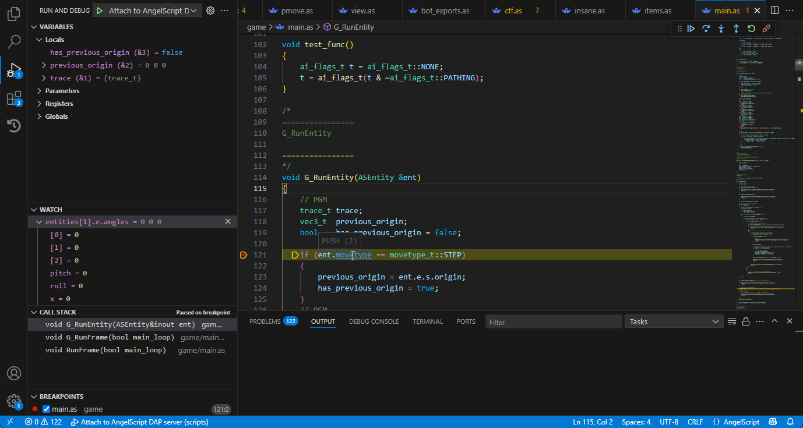

# angelscript-debugger
A simple, integrated debugger for AngelScript, targeting support for the Debug Adapter Protocol.

I wrote this framework for a project I'm working on.
I don't have a ton of time to do support or updates, this is just here for anybody who might find any use for it and is provided as-is.
I will be slapping any updates I do directly to this repository - there will likely not be any stable/rolling releases.



# Works with
* angel-lsp (https://github.com/sashi0034/angel-lsp / https://marketplace.visualstudio.com/items?itemName=sashi0034.angel-lsp)
* any generic DAP provider

# What is it?

A set of types and logic to make adding debuggers to AngelScript easy.
In addition, it includes the base for a DAP debugger that should work with
any extension or editor that supports the Debug Adapter Protocol.
It's designed to be simple; it likely won't be exactly what you're looking for
if you're looking for something like this, but it will
be close enough that you can tweak it to fit what you need.
(In other words it is not zero-configuration)

# What does it need?

Debugger component:
* AngelScript 2.38.0 minimum ( https://www.angelcode.com/angelscript/wip.php ); this is designed
  on bleeding edge, so it may use features that aren't compatible with 2.37.x and below.
* C++17 minimum (this can be worked around, but I wrote this quickly and am targeting C++17 for my uses)
* STL
* fmtlib (if C++17; on C++20, `std::format` will be used automatically)

DAP support:
* [cppdap](https://github.com/google/cppdap/tree/main/include/dap)

# How do I implement it? (the debugger)
A full tutorial is not something I plan to write up any time soon, but I will have an example in a live
project some time this month to link to this repository.

The basic jist is as follows:
* create a `asIDBWorkspace` (either directly or via subclass), which is required to
  inform the debugger about sources and also keeps track of breakpointable lines.
* subclass `asIDBDebugger` and `asIDBCache`; the latter is not technically necessary but
  you will likely end up doing it anyways, since you will likely want to provide custom
  evaluators for your own types. There are built-in evaluators, but they may not work for
  everything.
* implement the abstract functions of the formers' subclass. Exactly what you do during
  Suspend/Resume is going to be dependent on how you're using AngelScript. In my case
  I am using single-threaded execution, so I have `Suspend` create the UI & thread
  for UI tasks and then spin-loop until the UI tells the debugger it is safe to proceed.
* When necessary, create an instance of the debugger subclass. In its initial state, it does nothing and is completely dormant.
  This is by design: I wanted it to be zero-overhead (or as close to it as possible) when the debugger
  has no reason to use precious cycles.
* Whenever you request or create an AS context, check if your debugger is created and if
  HasWork() is true; if so, you should call `HookContext` on the context before `Execute` is called.
  Note that the debugger can only be hooked onto one context at a timne.
* If HasWork() is false, you can safely destroy the debugger. It will remain true as long as
  the debugger has something left to do (it has breakpoints waiting, or it's doing cursor execution).

This on its own is enough to have the debugger 'work'. You only need to make the debugger
if you have work for it to do.

To get things to happen:
* directly call `DebugBreak` on the debugger. This forces the active AngelScript context to immediately break.
  You can then use any sort of interface to interact with the debugger. Undefined behavior will happen
  if you break without an active context.
* add a breakpoint via `ToggleBreakpoint`. You can add a breakpoint onto a function name, or
  a section + line combination. 

# How do I enable DAP support?
* create a `asIDBDAPServer` in your `asIDBDebugger` subclass, call `StartServer`.
* for a simple single-threaded engine, your custom `Suspend` implementation should
  send a `dap::StoppedEvent` to the server and block.
* make sure to call `Tick()` on the server
* in your `Resume` implementation, signal to the `Suspend` loop
  can unblock.

# How do I customize type displays?
* The type display stuff is part of `asIDBCache`; when an evaluator is requested
  it will call `GetEvaluator`, which must return a type that can fill info
  about a variable of the given type. You can hook this into your custom workspace
  for instance to provide a way to dispatch evaluators.
* Evaluators must extend `asIDBTypeEvaluator`. They only need to provide two operations:
  `Evaluate` and `Expand`.
* `Evaluate` is called when a variable is first being sent back to the DAP. It must
  supply a name, type, value, as well as marking whether the variable can be expanded.
  If you don't mark a variable as expandable, it will not be allocated a ref ID and
  won't show as expandable in the debugger.
* `Expand` is called when a variable is expanded via its ref ID. From here you
  should add children to the node.

The default views should be good for most basic types. It supports
properties & iterating the `foreach` elements. Enums are treated as singular
values unless out-of-band or mixed values are specified, in which case it is assumed
to be a bitset and will display the bits and their names (+ the remainder, etc).

Note that the default iteration view will show every iteration value;
this might look weird for something like `array`, if you're
using the AngelScript CScriptArray, because it supports iterating two values (the value
and the index). For cases like this, the property and foreach iterator functions are
separated, so you can easily make a custom subtype like this:

```cpp
class q2as_asIDBArrayTypeEvaluator : public asIDBObjectTypeEvaluator
{
public:
    virtual void Expand(asIDBVariable::Ptr var) const override
    {
        QueryVariableForEach(var, 0);
    }
};
```

# Quick DAP support table
  - [ ] Attach
  - [x] BreakpointLocations
  - [ ] Completions
  - [x] ConfigurationDone
  - [x] Continue
  - [ ] DataBreakpointInfo
  - [ ] Disassemble
  - [x] Disconnect
  - [x] Evaluate
  - [ ] ExceptionInfo
  - [ ] Goto
  - [ ] GotoTargets
  - [x] Initialize
  - [ ] Launch
  - [ ] LoadedSources
  - [ ] Locations
  - [ ] Modules
  - [x] Next
  - [ ] Pause
  - [ ] ReadMemory
  - [ ] Restart
  - [ ] RestartFrame
  - [ ] ReverseContinue
  - [x] Scopes
  - [x] SetBreakpoints
  - [ ] SetDataBreakpoints
  - [ ] SetExceptionBreakpoints
  - [ ] SetExpression
  - [x] SetFunctionBreakpoints
  - [ ] SetInstructionBreakpoints
  - [ ] SetVariable
  - [ ] Source
  - [x] StackTrace
  - [ ] StepBack
  - [x] StepIn
  - [ ] StepInTargets
  - [x] StepOut
  - [ ] Terminate
  - [ ] TerminateThreads
  - [x] Threads

# DAP Capability Table (anything not here is assumed false)
  - [x] supportsClipboardContext
  - [x] supportsConfigurationDoneRequest
  - [x] supportsDelayedStackTraceLoading
  - [x] supportsEvaluateForHovers
  - [x] supportsFunctionBreakpoints
  - [x] supportsBreakpointLocationsRequest
  
# TODO / coming soon
* mostly cleanup and breakpoint rejiggering
* finish off DAP compatibility

# Probably not happening
* proper module support; this is kind of WIP, it does support multiple
  engines and modules but I've not tested with actual modules.
* better error handling; right now the code makes a lot of assumptions about AS stuff
  and doesn't check for errors.
